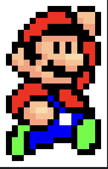

# 🖼️ Image Processor

A lightweight and modern C++ project that manipulates RGB images at the pixel level — reading, modifying, resizing, and saving them as BMP or PNG files.

---

## 🎯 Overview

**Image Processor** lets you:
- Load image data from `Images.txt`
- Modify pixels and apply RGB transformations
- Double an image’s width or height dynamically
- Export the final result as a `.bmp` or `.png`  
- Visualize the structure directly in the console

---

## 🏗️ Project Structure
```
ImageProcessor/
│
├── TD4.cpp           # Main source file
├── CMakeLists.txt    # Build configuration
├── Images.txt        # Input data
├── mario.png         # Example output image (used below 👇)
└── README.md         # Project documentation
```

---

## 🚀 Build & Run

### Using **CMake**
```bash
mkdir build && cd build
cmake ..
make
./TD4
```

### Or directly with **g++**
```bash
g++ -std=c++20 TD4.cpp -o TD4
./TD4
```

---

## 🎨 Example Output

Here’s an example of the generated **Mario image** 👇  



